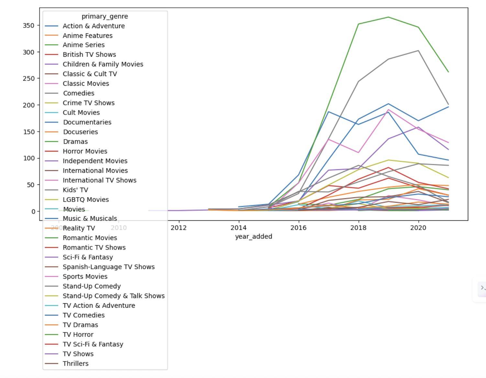

# 🎬 Netflix Content Strategy Analysis

## 📌 Project Overview

This project analyzes Netflix's content dataset to uncover trends in content growth, genre distribution, ratings, and global expansion strategy. The goal is to extract meaningful business insights using data analysis techniques.

---

## 🎯 Business Problem

Netflix needs to understand content trends, audience preferences, and global expansion strategies to optimize its content investment decisions and maximize user engagement.

---

## 🛠 Tech Stack

- Python  
- Pandas  
- NumPy  
- Matplotlib  
- Seaborn  

---

## 📊 Sample Visualization



---

## 📌 Key Insights

- Netflix content grew exponentially after 2015  
- Movies dominate the platform, but TV Shows are rapidly increasing  
- Most content is rated **TV-MA**, indicating mature audience targeting  
- Majority of movies fall within **80–120 minutes duration**  
- Top genres include **Drama, Documentaries, and Stand-Up Comedy**

---

## 🚀 Strategic Insights

- Increasing TV show production suggests focus on long-term user engagement  
- Growth in international content reflects Netflix’s global expansion strategy  
- Consistent movie duration indicates optimization for viewer retention  
- Dominance of mature content highlights target audience preferences  

---

## ⚠️ Limitations

- Dataset contains data only up to 2020  
- Missing values in some columns may affect accuracy  
- No user engagement or watch-time data available  
- Genre data is combined in a single column, limiting deeper analysis  

---

## 🔮 Future Outlook

Netflix is likely to continue investing in international content and expanding its TV show library. The platform may further optimize content length and diversify genres to maintain global audience engagement.

---

## 🏁 Conclusion

This project demonstrates how data analysis can be used to extract meaningful insights and understand real-world business strategies. It highlights Netflix’s focus on global expansion and engagement-driven content.

---

## 📁 Project Structure


```
netflix-content-strategy-analysis/
│
├── notebook/
│   └── netflix_content_strategy_analysis.ipynb
│
├── data/
│   └── netflix_titles.csv
│
├── README.md
└── requirements.txt
```

---

## 👩‍💻 Author

**Sakshi Singh**  
Aspiring Data Scientist | Data Analytics Enthusiast  
